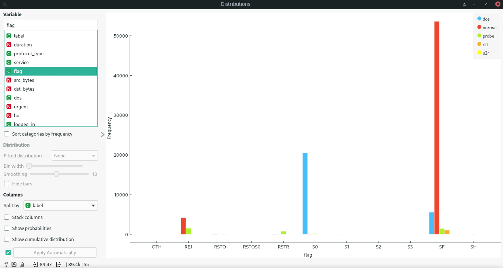
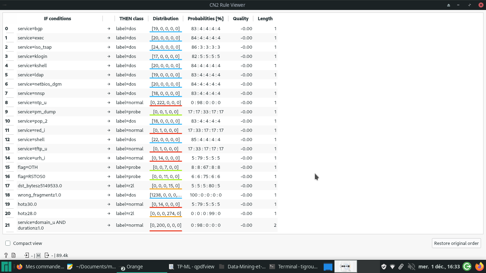

# Data-Mining-et-ML

## Question 1
Il y a 89418 instances et 41 features (41 features + 1 colonne de label, soit 42 au total). Le "N" signifie "numeric" (valeurs numériques continues) et le "C" "categorical" (valeurs discrètes). L'attribut "label" permet de dire si la ligne est issue d'une attaque ou bien si elle est normale.

## Question 2

La classe "normale" est majoritaire. En ce qui concerne les attaques, DOS est largement majoritaire dans notre jeu de données et c'est également ce qui est le cas sur internet.
Cependant ce dataset n'est pas représentatif des attaques sur internet en 2021 car il manque notamment des types d'attaques comme les injections SQL...

## Question 3

La valeur "SO" de attribut "flag" est majoritairement liée aux attaques DOS.
La valeur 1 de "dst_host_srv_serror_rate" est lié aux attaques DOS.
La valeur 500 de "srv_count" est liée aux attaques DOS.

## Question 4
Les 5 attributs les plus corrélées d'après "Gini" sont :
1. flag
2. servor_rate
3. dst_host_serror_rate
4. dst_host_srv_serror_rate
5. srv_serror_rate

## Question 5

Par exemple, prenons l'attribut "flag". On avait déjà vu dans la question 3 que sa valeur "SO" était liée aux attaques DOS

## Question 6

(Penser à décocher la case "induce binary tree" de Tree).

## Question 7

* Arbre :

	- Avec les règles aprises :  on a probe à 97 % avec "dst_host_srv_rerror_rate >=01 AND service=other"
	- Avec l'arbre de décision : on a probe à 10% avec la valeur "OTH" du flag

## Question 8

* arbre

	- accuracy : 0.994
	- nombre de faux positifs : 87
	- nombre de faux négatifs : 190
	- En supposant dix connexions légitimes par seconde, nombre de
faux positifs par jour en moyenne : on a donc 864 000 connexions légitimes par jour. On a 87 faux positifs parmi les 57 979 instances légitimes, donc en une journée, cela génèrerait 1297 faux positifs

* random forest

	- accuracy : 0.999
	- nombre de faux positifs : 17
	- nombre de faux négatifs :  83
	- En supposant dix connexions légitimes par seconde, nombre de
faux positifs par jour en moyenne : 253

* CNN

	- accuracy : 0.995
	- nombre de faux positifs : 110
	- nombre de faux négatifs : 188
	- En supposant dix connexions légitimes par seconde, nombre de
faux positifs par jour en moyenne : 1639

Le nombre de faux positif par jour n'est pas satisfaisant : dans les 3 cas, une personne aurait du mal à vérifier chacun des faux positifs alors même que l'accuracy semble élevé. Il est nécessaire de réaliser un filtrage automatique plus précis de tous les cas positifs avant une vérification manuelle. On remarque aussi que les forêts d'arbres aléatoires ont une meilleure accuracy et moins de faux positifs/négatifs que les arbres seuls ou les CNN, le modèle est donc plus performant.

